# Project Objective

Build a fully automated serverless media processing pipeline using AWS

Allow users to upload images securely using pre-signed URLs

Automatically process images (resize + watermark) using Lambda

Store processed images in a separate S3 bucket
Enable global content delivery using CloudFront
Implement cost optimization using S3 lifecycle policies

Ensure high availability and durability using Cross-Region Replication

# Project Overview

Users upload images to S3 using pre-signed URLs

Images are stored in a raw uploads bucket

S3 event triggers a Lambda function automatically
Lambda processes images by:

Resizing (800x600)
Adding watermark

Processed images are stored in a processed bucket

Images are distributed globally via CloudFront + Lambda@Edge

Lifecycle rules move old data:
Standard → IA → Glacier

Cross-region replication ensures backup in another region

# PART 1 — CREATE S3 BUCKETS
Step 1: Open S3

Login to AWS Console

Search → Amazon S3

Click Buckets

Step 2: Create Raw Upload Bucket

Click Create bucket

Enter:

Bucket name: raw-uploads-indu

Region: Asia Pacific (Mumbai) ap-south-1
Enable:

✅ Versioning
Encryption:

SSE-S3
Click Create bucket

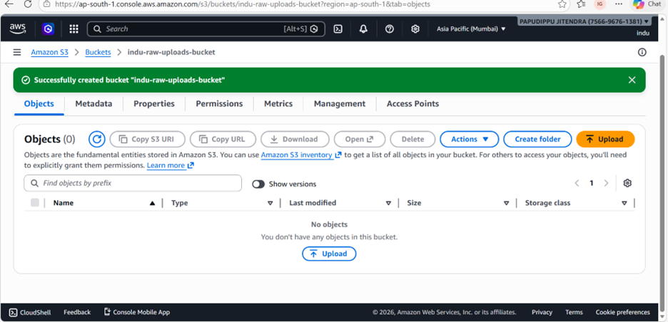

## Step 3: Add CORS
Open bucket → Permissions

Scroll → CORS configuration → Edit

Paste:
[{"AllowedHeaders": ["*"], "AllowedMethods": ["PUT", "GET"], "AllowedOrigins": ["*"]}]
Save
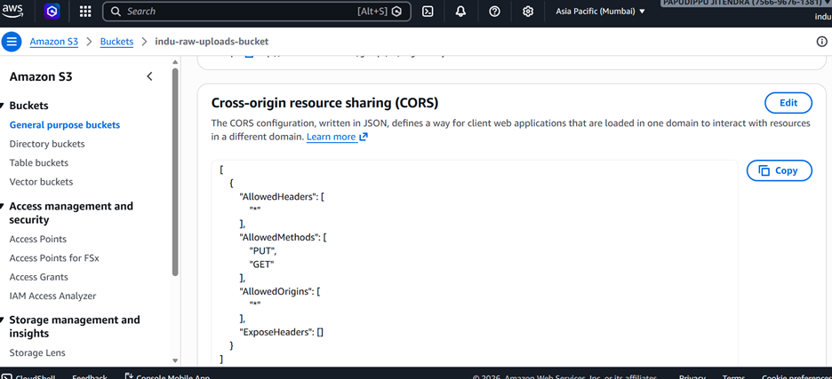

## Step 4: Create Processed Bucket
Click Create bucket

Enter:

Name: processed-images-<unique>
Region: ap-south-1
Enable:

✅ Versioning
✅ Encryption → SSE-KMS (aws/s3)
Click Create bucket
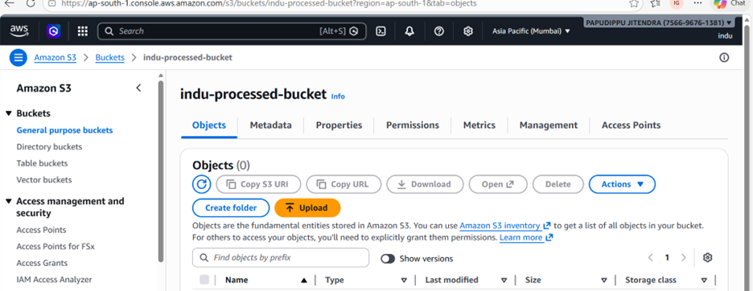

 PART 2 — CROSS-REGION REPLICATION

Step 5: Create Destination Bucket (Ireland)

# Create bucket:
Name: raw-uploads-replica-<unique>

Region: Europe (Ireland) eu-west-1

Enable:

✅ Versioning (MANDATORY)

Step 6: Configure Replication

Open raw bucket

Go to Management → Replication → Create rule

Step 7: Setup Rule

Rule name: replicate-all

Scope: Apply to all objects
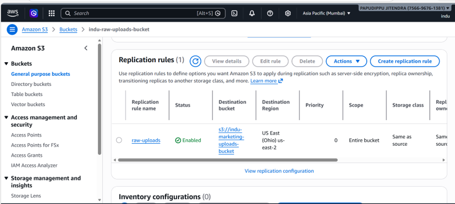

![05-cereate life cycle rules]
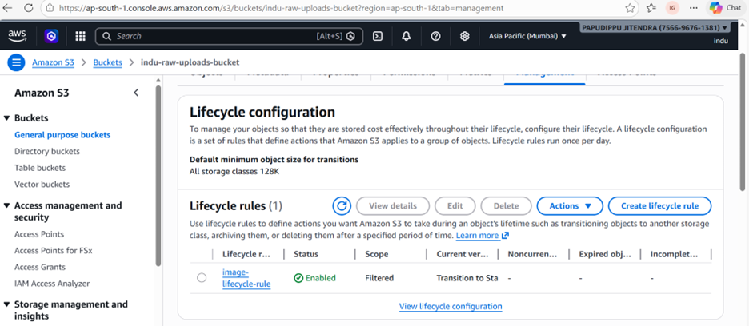

Step 8: Select Destination Bucket

Destination → Choose bucket

Select: raw-uploads-replica-<unique>

Step 9: IAM Role

Select: Create new role

Step 10: Save

Click Save

PART 3 — LIFECYCLE RULES

Step 11: Add Lifecycle Rule

Open raw bucket → Management

Click Lifecycle rules → Create rule

Step 12: Configure

Name: archive-rule

Apply to all objects

Add transitions:

After 30 days → Standard-IA
After 365 days → Glacier
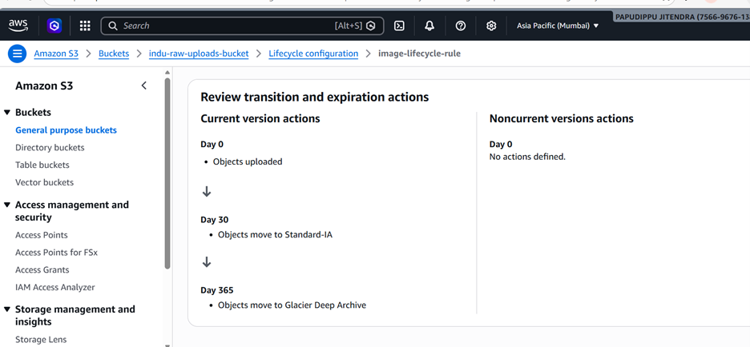

Save

PART 4 — LAMBDA IMAGE PROCESSOR

Step 13: Open Lambda

Go to AWS Lambda

Step 14: Create Function

Click Create function

Choose: Author from scratch

Name: image-processor

Runtime: Python 3.11
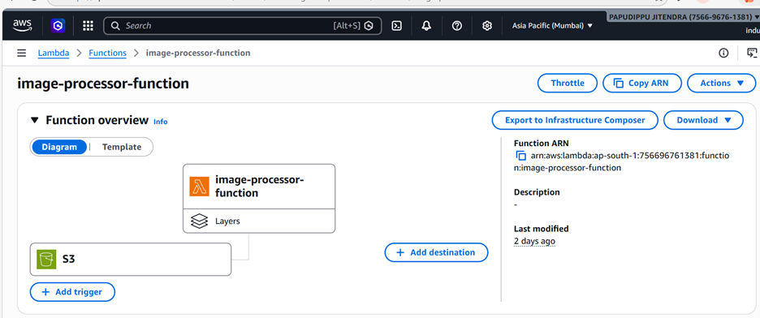

Step 15: Configure Memory

Configuration → General configuration

Memory: 512 MB

Timeout: 30 seconds
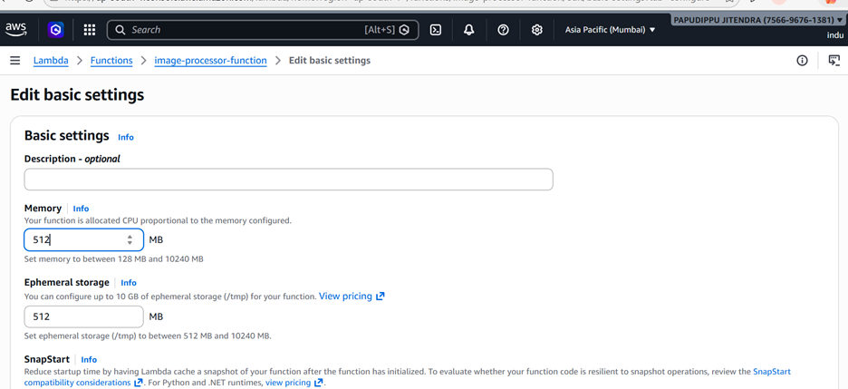

Step 16: Add S3 Trigger

Source: S3

Bucket: raw-uploads

Event: PUT (ObjectCreated)
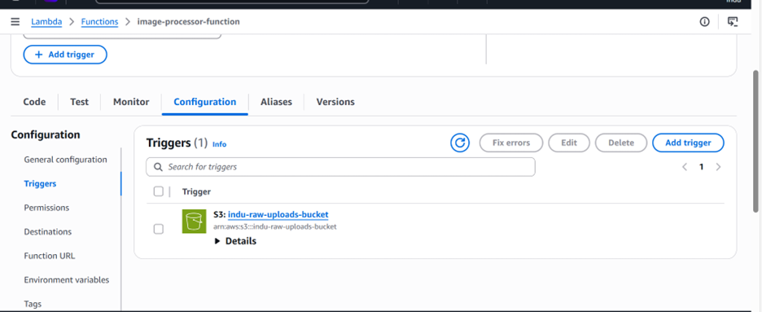

Step 17: Add Pillow Layer
Add Pillow dependency (layer or zip)
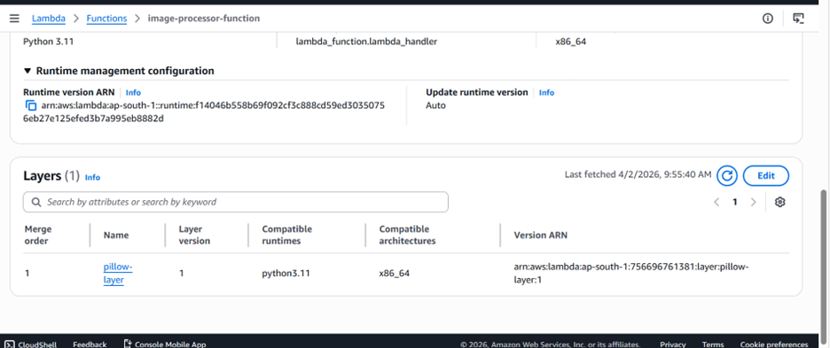

Step 18: Lambda Code
import boto3
from PIL import Image, ImageDraw
import io

s3 = boto3.client('s3')
DEST_BUCKET = 'processed-images-<name>'

def lambda_handler(event, context):
    for record in event['Records']:
        bucket = record['s3']['bucket']['name']
        key = record['s3']['object']['key']

        file = s3.get_object(Bucket=bucket, Key=key)
        img = Image.open(io.BytesIO(file['Body'].read()))

        img = img.resize((800, 600))

        draw = ImageDraw.Draw(img)
        draw.text((10,10), "Watermark", fill=(255,255,255))

        buffer = io.BytesIO()
        img.save(buffer, "JPEG")
        buffer.seek(0)

        s3.put_object(
            Bucket=DEST_BUCKET,
            Key=f"processed/{key}",
            Body=buffer
        )

PART 5 — DLQ (SQS)

Step 19: Create Queue

Open Amazon SQS

Create queue: lambda-dlq

Step 20: Attach DLQ

Lambda → Configuration → Destinations
On failure → SQS → select queue

PART 6 — PRE-SIGNED URL GENERATOR

Step 21: Create Lambda

Name: generate-url

Runtime: Python 3.11
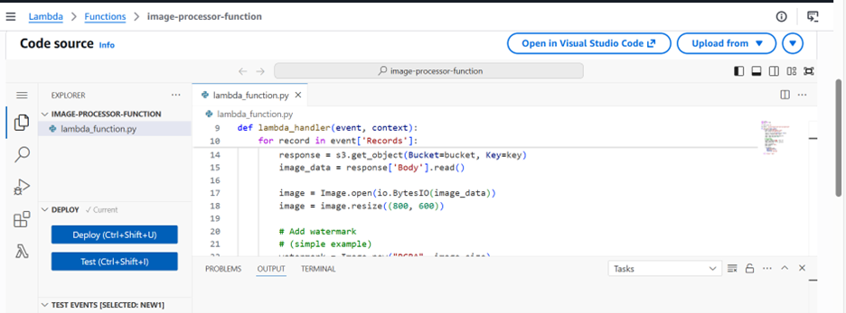

![10-lambda layer 2added with code]
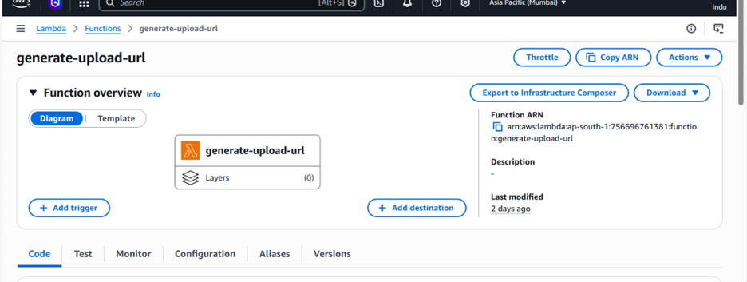

Step 22: Code

import boto3

s3 = boto3.client('s3')

def lambda_handler(event, context):
    url = s3.generate_presigned_url(
        'put_object',
        Params={'Bucket': 'raw-uploads-<name>', 'Key': 'test.jpg'},
        ExpiresIn=900
    )
    return {"url": url}
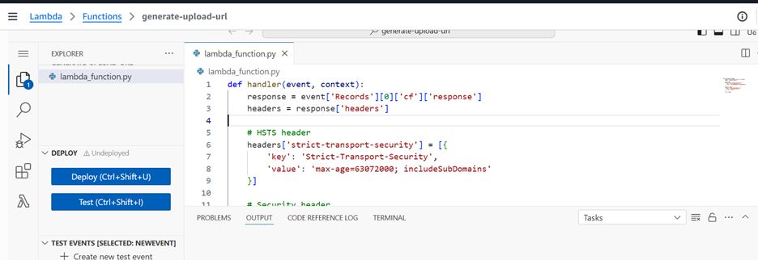    
PART 7 — TESTING

Step 23: Generate URL

Run Lambda → Copy URL
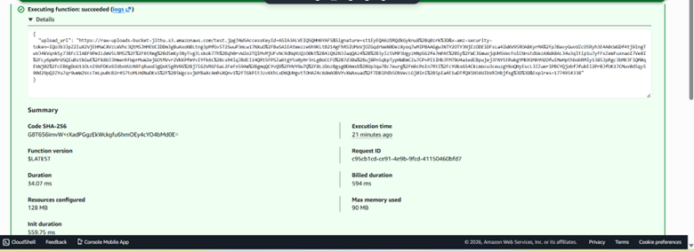

Step 24: Upload Image

curl -X PUT -T image.jpg "<URL>"
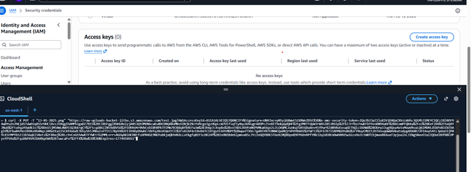

Step 25: Verify

Raw bucket → file exists

Processed bucket → processed file exists
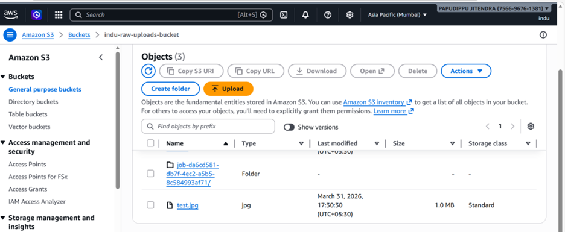

Step 26: Check Replication

Open Ireland bucket

File should appear

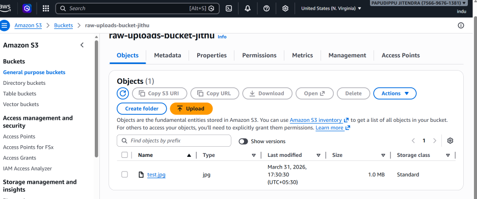

# Conclusion
This project demonstrates a fully serverless, scalable, and cost-efficient media pipeline built on AWS. By combining S3, Lambda, CloudFront, and lifecycle policies, you eliminate the need for servers while achieving:

•	⚡ Automatic image processing at scale 

•	🌍 Global low-latency delivery via CDN 

•	🔒 Secure uploads using pre-signed URLs 

•	💰 Optimized storage costs with lifecycle rules 

•	🔁 High availability with cross-region replication
